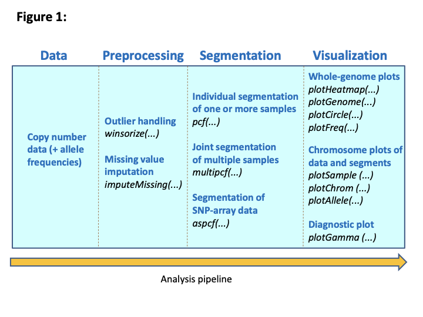

# An overview of the copynumber package

## Introduction

This document gives an overview and demonstration of the `copynumber`
package, which provides tools for the segmentation and visualization of
copy number data. In the analysis of such data a goal is to detect and
locate areas of the genome with copy number abberations. This may help
identify genes that are critical to the development and progression of
cancer. To locate areas or segments of equal copy numbers, our methods
make *Piecewise Constant Fits* to the data through penalized least
squares minimization (Nilsen et al., 2012). That is, piecewise constant
curves are fitted to the data by minimizing the distance between the
curve and the observed data, while imposing a penalty for each
discontinuity in the curve. Segmentation may be done on a single sample,
simultaneously on several samples or simultaneously on different data
tracks.

This is a fork of the archived Bioconductor package, adding support for
more recent genome builds. See the [GitHub
repository](https://github.com/igordot/copynumber) for source and
issues.

## Overview

The diagram below gives an overview of the `copynumber` package and
illustrates the natural workflow. Each part of this workflow is
described below.



An overview of the copynumber package.

### Data input

The data input in the `copynumber` package is normalized and
log-transformed copy number measurements, for one or several samples.
Allele-frequencies may also be specified for the segmentation of
SNP-array data.

The data should be organized as a data matrix where each row represents
a probe, and the first two columns give the chromosomes and genomic
positions (locally in the chromosome) corresponding to each probe.
Subsequent columns should hold the copy number measurements for each
sample, and the header of these sample columns should be a sample
identifier. For SNP-array data two such data matrices are required; one
holding the LogR copy numbers and the other holding the B-allele
frequencies (BAF).

### Preprocessing

#### Outlier handling

Outliers are common in copy number data, and may have a substantial
negative effect on the segmentation results. It is therefore strongly
recommended to detect and modify extreme observations prior to
segmentation. In the package we do this by Winsorization, and the method
`winsorize` is available for this purpose.

#### Imputation of missing data

The method `imputeMissing` may be used for the imputation of missing
copy number measurements. The user may decide on imputation by a
constant or by an estimate based on the pcf-value (see below) of the
nearest non-missing probes.

### Segmentation

#### Segmentation tools

The `copynumber` package provides three segmentation tools. The method
`pcf` handles the single-sample case, where segmentation is done
independently for each sample in the data set, and the break points thus
differ from sample to sample. The method `multipcf` runs on multiple
samples simultaneously, and fits segmentation curves with common break
points for all samples. The segment values will for each sample be equal
to its average measurement on the segment. The third method, `aspcf`, is
intended for SNP array data and performs allele-specific segmentation.
This results in segmentation curves where break points are common for
LogR and BAF data in the individual samples.

#### Choose model parameters

The most important parameter to set in the segmentation routines is
`gamma`, which determines the penalty to be applied for each
discontinuity or break point in the segmentation curve. Note that the
default value will not be appropriate for all data sets; it may depend
on the purpose of the study and artifacts may arise from the
experimental procedure. Hence it is typically necessary to test a number
of `gamma` values to find the optimal one. A valuable tool in this
context is the diagnostic tool `plotGamma`, where segmentation is run
for 10 different values of `gamma` and results are then displayed in a
multigrid plot. This allows the user to explore the appropriateness of
each segmentation result. Another parameter that influences the
segmentation result is `kmin`, which imposes a minimum length (number of
probes) for each segment.

### Visualization

Several tools are available in the package for the plotting of data and
segmentation results. These include `plotGenome`, `plotSample`, and
`plotChrom` where data and/or segments are plotted over the entire
genome, for a given sample across different chromosomes and for a given
chromosome across different samples, respectively. Other graphical tools
include `plotHeatmap`, which plots copy numbers heatmaps, and
`plotFreq`, which plots the frequency of samples with an aberration at a
genomic position. In addition, `plotCircle` enables the plotting of the
genome as a circle with aberration frequencies and connections between
genomic loci added to the middle of the circle.

## Data sets

The package includes three data sets that are used in the examples
below:

- `lymphoma`: 3K aCGH data for a subset of 21 samples (Eide et al.,
  2010).
- `micma`: A subset of a 244K aCGH data set. Contains data on chromosome
  17 for 6 samples (Mathiesen et al., 2011).
- `logR` and `BAF`: Artificial 10K SNP array data for 2 samples.

## Examples

The following examples illustrate some applications of the `copynumber`
package. First, load the package in R:

``` r

library(copynumber)
```

    ## Loading required package: BiocGenerics

    ## Loading required package: generics

    ## 
    ## Attaching package: 'generics'

    ## The following objects are masked from 'package:base':
    ## 
    ##     as.difftime, as.factor, as.ordered, intersect, is.element, setdiff,
    ##     setequal, union

    ## 
    ## Attaching package: 'BiocGenerics'

    ## The following objects are masked from 'package:stats':
    ## 
    ##     IQR, mad, sd, var, xtabs

    ## The following objects are masked from 'package:base':
    ## 
    ##     anyDuplicated, aperm, append, as.data.frame, basename, cbind,
    ##     colnames, dirname, do.call, duplicated, eval, evalq, Filter, Find,
    ##     get, grep, grepl, is.unsorted, lapply, Map, mapply, match, mget,
    ##     order, paste, pmax, pmax.int, pmin, pmin.int, Position, rank,
    ##     rbind, Reduce, rownames, sapply, saveRDS, table, tapply, unique,
    ##     unsplit, which.max, which.min

### Single-sample segmentation

In this example we will use the `lymphoma` data:

``` r

data(lymphoma)
```

The data set has chromosomes and probe positions in the two first
columns, and the copy number measurements for 21 samples in the
subsequent columns. In this example we will only use a subset containing
the first 3 samples, which corresponds to three biopsies from one
patient taken at different time points. We can use the function
`subsetData` to retrieve the desired data subset:

``` r

sub.lymphoma <- subsetData(data = lymphoma, sample = 1:3)
sub.lymphoma[1:10, ]
```

    ##    Chrom Median.bp  X01.B1  X01.B2  X01.B3
    ## 1      1   1082138  0.0906 -0.0144  0.0255
    ## 2      1   3318085 -0.0992 -0.1693 -0.0908
    ## 3      1   4552927 -0.0884 -0.0807  0.0401
    ## 4      1   5966170 -0.0503 -0.0231 -0.1081
    ## 5      1   7134999 -0.0970 -0.0145 -0.1877
    ## 6      1   7754220 -0.0671 -0.0291 -0.0506
    ## 7      1   9211391 -0.0386 -0.1290 -0.0058
    ## 8      1  10134471 -0.0281 -0.0507 -0.6507
    ## 9      1  11054335 -0.0231 -0.0520 -0.5539
    ## 10     1  11562778 -0.0780 -0.0742 -0.0531

Next we identify and modify outliers by the function `winsorize`:

``` r

lymph.wins <- winsorize(data = sub.lymphoma, verbose = FALSE)
```

The parameter `verbose = FALSE` just keeps the function from printing a
progress message each time the analysis is finished for a new chromosome
arm. The primary output from `winsorize` is then a new data frame
(`lymph.wins`) on the same format as the input data where the sample
columns now contain the Winsorized data values:

``` r

lymph.wins[1:10, ]
```

    ##    chrom      pos  X01.B1  X01.B2  X01.B3
    ## 1      1  1082138  0.0284 -0.0144  0.0255
    ## 2      1  3318085 -0.0992 -0.1693 -0.0908
    ## 3      1  4552927 -0.0884 -0.0807  0.0401
    ## 4      1  5966170 -0.0503 -0.0231 -0.1081
    ## 5      1  7134999 -0.0970 -0.0145 -0.1877
    ## 6      1  7754220 -0.0671 -0.0291 -0.0506
    ## 7      1  9211391 -0.0386 -0.1290 -0.0058
    ## 8      1 10134471 -0.0281 -0.0507 -0.2938
    ## 9      1 11054335 -0.0231 -0.0520 -0.3034
    ## 10     1 11562778 -0.0780 -0.0742 -0.0531

In addition, if the parameter `return.outliers` is set to `TRUE`, the
method also returns a data frame which shows which observations have
been classified as outliers:

``` r

wins.res <- winsorize(data = sub.lymphoma, return.outliers = TRUE, verbose = FALSE)
wins.res$wins.outliers[1:10, ]
```

    ##    chrom      pos X01.B1 X01.B2 X01.B3
    ## 1      1  1082138      1      0      0
    ## 2      1  3318085      0      0      0
    ## 3      1  4552927      0      0      0
    ## 4      1  5966170      0      0      0
    ## 5      1  7134999      0      0      0
    ## 6      1  7754220      0      0      0
    ## 7      1  9211391      0      0      0
    ## 8      1 10134471      0      0     -1
    ## 9      1 11054335      0      0     -1
    ## 10     1 11562778      0      0      0

The values 1 and -1 indicate outliers, reflecting that the original
observation has been truncated to a smaller and higher value,
respectively. The value 0 indicates that the observation is not an
outlier and that the Winsorized value is identical to the original
value. Note that one may obtain the winsorized data values in this
setting by `wins.res$wins.data`.

Next we want to fit segmentation curves to each of the samples in our
data using the function `pcf`. When Winsorization has been done, the
Winsorized data should be the input (if one wants the segment values to
equal the means of the observed data instead of the Winsorized data, one
may in addition give the original data as input via the parameter
`Y = sub.lymphoma`). The penalty parameter `gamma` is in this case set
to 12 to achieve high sensitivity on these low-resolution data.

``` r

single.seg <- pcf(data = lymph.wins, gamma = 12, verbose = FALSE)
```

The default output of `pcf` is a data frame with 7 columns giving
information about each segment found in the data. SampleIDs are given in
the first column. Below we see the first six segments found in the
subset of lymphoma samples:

``` r

head(single.seg)
```

    ##   sampleID chrom arm start.pos   end.pos n.probes    mean
    ## 1   X01.B1     1   p   1082138  64194749       70 -0.0455
    ## 2   X01.B1     1   p  65355304 119515493       58  0.0450
    ## 3   X01.B2     1   p   1082138  50340843       56 -0.0442
    ## 4   X01.B2     1   p  50638118 119515493       72  0.0219
    ## 5   X01.B3     1   p   1082138 119515493      128 -0.0329
    ## 6   X01.B1     1   q 142174575 146617392        8  0.0120

After the segmentation one may plot the data along with the segmentation
results to see how well the segmentation fits the data. To plot the copy
number data and the segmentation results over the entire genome we apply
the function `plotGenome`, as illustrated below for one of the samples.

``` r

plotGenome(data = sub.lymphoma, segments = single.seg, sample = 1, cex = 3)
```


Genome plot for the sample X01.B1. Segmentation done by pcf.

Another plotting option is `plotSample`, where the data and segmentation
results are shown for one sample with chromosomes in different panels.
This is shown for the first sample below. Chromosome ideograms are by
default added to the bottom of the plots.

``` r

plotSample(data = sub.lymphoma, segments = single.seg, layout = c(5, 5), sample = 1, cex = 3)
```


Sample X01.B1 plotted across the 23 chromosomes. Segmentation done by
pcf.

### Multi-sample segmentation

In the second example we illustrate multi-sample segmentation using the
function `multipcf` on the three successive biopsies for sample X01.
Input parameters and the output is similar to that of `pcf`, but the
data frame holding the segmentation results now have common rows for all
samples since they all have common segment boundaries:

``` r

multi.seg <- multipcf(data = lymph.wins, verbose = FALSE)
head(multi.seg)
```

    ##   chrom arm start.pos   end.pos n.probes  X01.B1  X01.B2  X01.B3
    ## 1     1   p   1082138  64194749       70 -0.0455 -0.0336 -0.0376
    ## 2     1   p  65355304 119515493       58  0.0450  0.0251 -0.0272
    ## 3     1   q 142174575 146617392        8  0.0120  0.0495 -0.0317
    ## 4     1   q 146756663 245340016      129  0.4038  0.0263 -0.0091
    ## 5     2   p    314759  89830600      107  0.0026  0.0004  0.0175
    ## 6     2   q  94941109 242568229      159  0.0063  0.0111  0.0061

To compare the segmentation results between samples we may use the
function `plotChrom`. Here data and segments are plotted for one
chromosome with samples in different panels, as illustrated below.

``` r

plotChrom(data = lymph.wins, segments = multi.seg, layout = c(3, 1), chrom = 1)
```


Chromosome 1 plotted for the 3 biopsies taken at different time points
for sample X01. Segmentation done by multipcf.

### Allele-specific segmentation

To illustrate allele-specific segmentation, we apply the artificial
SNP-array data set containing both LogR data and BAF data:

``` r

data(logR)
data(BAF)
```

We start by Winsorizing the LogR data:

``` r

logR.wins <- winsorize(logR, verbose = FALSE)
```

The function `aspcf` will perform the allele-specific segmentation,
taking both (Winsorized) LogR data and BAF data as input:

``` r

allele.seg <- aspcf(logR.wins, BAF, verbose = FALSE)
head(allele.seg)
```

    ##   sampleID chrom arm start.pos   end.pos n.probes logR.mean BAF.mean
    ## 1       S1     1   p   1695590  31067347      139   -0.2323   0.6916
    ## 2       S1     1   p  31101268  39640990       37    0.4000   0.7182
    ## 3       S1     1   p  39831894  46296225       34    0.1785   0.6207
    ## 4       S1     1   p  46437972  57577691       46    0.0289   0.5000
    ## 5       S1     1   p  57905199  60306875        9   -0.1552   0.6856
    ## 6       S1     1   p  60607571 100552011      128    0.0797   0.5000

Note that the output is similar to that of `pcf`, except for an extra
8’th column giving the segment BAF-values.

The function `plotAllele` may be used to plot the data and the
segmentation results. For a given sample the results are shown for both
the LogR- and BAF-track with chromosomes in different panels, as
illustrated below for the first sample on chromosomes 1-4.

``` r

plotAllele(logR, BAF, allele.seg, sample = 1, chrom = c(1:4), layout = c(2, 2))
```


Allele-specific plot for one sample on chromosomes 1-4. Segmentation
done by aspcf.

### Other graphical tools

#### Frequency plot

A useful graphical tool is `plotFreq`, where we plot the frequency of
samples in the data set with a gain or a loss at a genomic position. In
this example we use `pcf` to obtain copy number estimates for the entire
lymphoma data set:

``` r

lymphoma.res <- pcf(data = lymphoma, gamma = 12, verbose = FALSE)
```

Gains and losses will be regions where the copy number estimate is above
or below some defined thresholds specified by the parameters
`thres.gain` and `thres.loss`, respectively.

``` r

plotFreq(segments = lymphoma.res, thres.gain = 0.2, thres.loss = -0.1)
```


Frequencyplot for lymphoma data

The plot above shows the percentage of samples with estimated
$`\log_{2}`$ copy number ratios above the threshold $`0.2`$ (gain) in
red and below the threshold $`-0.1`$ (loss) in green. Frequencies may
also be plotted per chromosome by specifying chromosomes in the
parameter `chrom`.

#### Circle plot

A similar plotting routine is `plotCircle` which also shows the
aberration frequencies, but unlike `plotFreq` the genome is here
represented as a circle. The input is again copy number estimates, and
aberrations are defined as described above. In addition to plotting
aberration frequencies one may show associations between certain genomic
regions by specifying the parameter `arcs` as input. This should be a
matrix giving the chromosomes and positions for regions that are
connected, as well as a column specifying whether there are different
types of associations. One example of use is to plot strong
interchromosomal correlations between pairs of segments found by
`multipcf`.

Below, we assume that `multipcf` has been run on the `lymphoma` data,
and we have calculated the interchromosomal correlations between all
segment pairs (see the help file for `plotCircle` for details). Say
strong positive correlations were found between a segment with middle
position 168754669 on chromosome 2 and a segment with middle position
61475398 on chromosome 14, as well as between a segment with middle
position 847879349 on chromosome 12 and a segment with middle position
30195556 on chromosome 21. In addition, a strong negative correlation
was found between a segment with middle position 121809306 on chromosome
4 and a segment with middle position 12364465 on chromosome 17. Having
found the location of the associations we want to visualize we can then
define the matrix `arcs` holding the chromosome number and position of a
segment in the first two columns, and the chromsome number and position
of the associated segment in the next two columns. The fifth column
identifies positive correlations and negative correlations as class 1
and 2, respectively:

``` r

chr.from <- c(2, 12, 4)
pos.from <- c(168754669, 847879349, 121809306)
chr.to <- c(14, 21, 17)
pos.to <- c(6147539, 301955563, 12364465)
cl <- c(1, 1, 2)
arcs <- cbind(chr.from, pos.from, chr.to, pos.to, cl)
```

The plot below shows a circle plot. The gain frequencies are shown in
red, while loss frequencies are shown in green. In addition, the orange
and blue arcs connect the segments which were found to have high
positive and negative correlations, respectively.

``` r

plotCircle(segments = lymphoma.res, thres.gain = 0.15, arcs = arcs)
```


Circle plot for lymphoma data.

#### Heatmap

Another graphical function is `plotHeatmap`, which may be used to
examine differences between samples. Here a heatmap is plotted for each
sample according to the magnitude of the estimated copy number value
relative to some pre-defined limits. The plot below shows a heatplot for
the lymphoma samples. Each sample is represented by a row. The color red
indicates that the estimate is above the upper limit of $`0.3`$, while
the color blue indicates that it is below the lower limit of $`-0.3`$.
Darker nuances of red and blue indicate that the value is below and
above the upper and lower limit, respectively, and the darker the
nuance, the closer the value is to zero.

``` r

plotHeatmap(segments = lymphoma.res, upper.lim = 0.3)
```


Heatmap for lymphoma data.

#### Aberration plot

Similarly the function `plotAberration` is useful for locating recurrent
aberrations. An example is given below where each row represents a
sample and the colors red and blue indicate gains and losses,
respectively.

``` r

plotAberration(segments = lymphoma.res, thres.gain = 0.2)
```


Aberration plot for the lymphoma data.

#### Diagnostic plot for penalty selection

As mentioned earlier we may apply the function `plotGamma` to decide on
a reasonable choice for the penalty parameter in the segmentation
routines. This function will run `pcf` for a single sample and
chromosome using 10 values for `gamma` in the range indicated by the
parameter `gammaRange`. Each segmentation result is then plotted along
with the data in a multigrid plot, and the number of segments found for
each value of `gamma` is shown in the last panel. The plot below gives
an example using the first sample in the `micma` data.

``` r

data(micma)
plotGamma(micma, chrom = 17, cex = 3)
```


Diagnostic gamma plot for the first sample in the micma data. 10
different gamma-values are evaluated.

An additional option is to specify the parameter `cv = TRUE`, which
means that a 5-fold cross-validation is run for each value of `gamma`. A
graph showing the average residual error from the cross-validation is
then added in the last panel of the plot, and the value of `gamma` which
minimizes this error is marked by an asterix. This value may provide a
starting point for selecting `gamma`, but should not be used
uncritically because the cross-validation tends to favor too low values
and could favor detection of low-amplitude “aberrations” which may be
caused by artifacts related to the technology (e.g. due to GC-content).

## Tips

When the data set is very large an alternative to specifying the data
frame as input in `winsorize`, `pcf`, `multipcf` and `aspcf` is to
supply a txt-file as input in the `data` parameter. The data txt-file
should then be organized in the same way as described for the data
earlier, namely with chromosomes and genomic positions in the two first
columns, and sample copy number data in all subsequent columns. The data
will then be read in and processed chromosome arm by chromosome arm,
thus taking up less memory. Similarly, results can be stored in
txt-files by setting `save.res = TRUE` and optionally specifying
filenames.

Another way to handle large data sets is by applying the function
`subsetData` to break the data set into a smaller subset only containing
certain chromosomes and/or samples. Again, the input may be a data frame
or a data txt-file. This function is also useful when plotting the data,
and similarly `subsetSegments` may be used to get a subset of segments
for particular chromosomes and/or samples.

If it is not desirable to perform independent segmentations on each
chromosome arm, or if the assembly does not match one of hg16-hg19
(e.g. if the data comes from another species), the function `pcfPlain`
can be applied for single-sample segmentation.

In the data/segmentation plots (`plotGenome`, `plotSample`, `plotChrom`,
`plotAllele`) different segmentation results may be visualized together
by specifying the input parameter `segments` as a list. This enables
simultaneous examination and comparison of different segmentation
results e.g. obtained from `pcf` and `multipcf`, or by using different
values of `gamma`. See the help-files for these functions for examples.

Aberration calling for the segments found by `pcf` or `multipcf` is done
by the function `callAberrations`. Given user-specified thresholds, this
function classifies each segment as normal, gain or loss.

The function `selectSegments` can be used to retrieve potentially
interesting segments found by `multipcf`. Using this function one may
select segments based on a number of characteristics; segments with the
largest or smallest variance among the samples, the longest or shortest
segments, or the segments that have the largest aberration freqencies.

For the user familiar with the `GRanges` format from the `GenomicRanges`
package, it is possible to convert the segments data frame via the
function `getGRangesFormat`.

## References

Nilsen, G., Liestoel, K., Van Loo, P., Vollan, HKM., Eide, MB., Rueda,
OM., Chin, SF., Russel, R., Baumbusch, LO., Caldas, C., Borresen-Dale,
AL., Lingjaerde, OC. *Copynumber: Efficient algorithms for single- and
multi-track copy number segmentation*. BMC Genomics 13:591 (2012,
<doi:10.1186/1471-2164-13-59>).

Eide, MB., Liestoel, K., Lingjaerde, OC., Hystad, ME., Kresse, SH.,
Meza-Zepeda, L., Myklebost O., Troen, G., Aamot, HV., Holte, H.,
Smeland, EB., Delabie, J. *Genomic alterations reveal potential for
higher grade transformation in follicular lymphoma and confirm parallell
evolution of tumor cell clones*. Blood 116 (2010), 1489-1497.

Mathiesen, RR., Fjelldal, R., Liestoel, K., Due, EU., Geigl, JB.,
Riethdorf, S., Borgen, E., Rye, IH., Schneider, IJ., Obenauf, AC.,
Mauermann, O., Nilsen, G., Lingjaerde, OC., Borresen-Dale, AL., Pantel,
K., Speicher, MR., Naume, B., Baumbusch, LO. *High resolution analysis
of copy number changes in disseminated tumor cells of patients with
breast cancer*. Int J Cancer 131(4) (2011), E405-E415.
